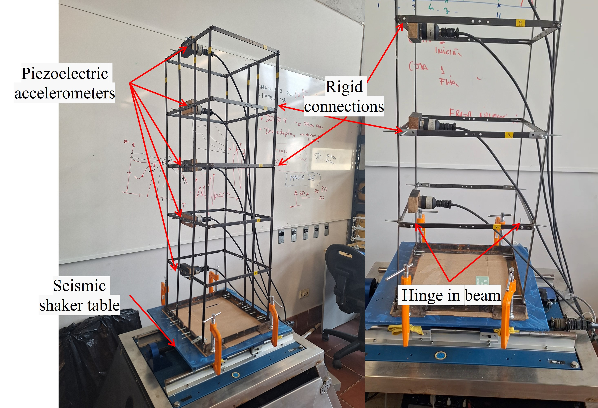
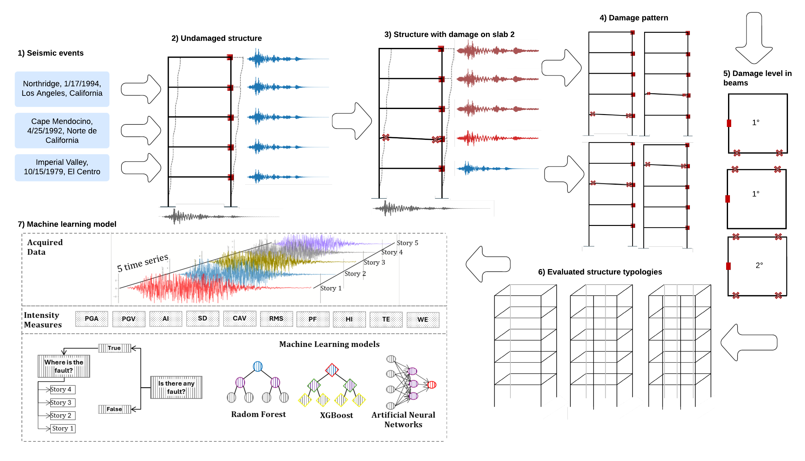

# Structural-Fault-Detection
An automated tool based on Machine learning techniques for the detection of structural failures

This repository contains the implementation of an automated structural fault detection system using machine learning techniques, as described in our research paper. The system can detect and localize structural damage in buildings by analyzing seismic sensor data.

*Figure 1: Experimental Setup - Three-Dimensional Model for Seismic Response Analysis at UTEC Laboratory*

## Research Summary

### Objective
The primary goal of this research was to develop and validate machine learning models capable of:
1. Detecting the presence of structural faults
2. Localizing structural damage within multi-story buildings

### Experimental Setup
- Construction of a scaled A36 steel structure:
  - Five slabs with 21cm separation
  - Total height: 109cm
  - Bolted beam-column connections
  - Five strategically placed piezoelectric accelerometers
- Testing conditions:
  - Simulated seismic events: Northridge (1994), Cape Mendocino (1992), Imperial Valley (1979)
  - Magnitude range: 6.4 to 7.2 Mw
  - Unidirectional shake table testing

*Figure 2: Comprehensive Methodology Framework - From Data Acquisition to Model Implementation*

### Methodology
1. **Data Collection**
   - ~2,500 seismic records
   - 39.15% from undamaged structure
   - 60.85% from various damage scenarios
   - Progressive damage implementation through induced hinges

2. **Signal Processing**
   - Application of weighted moving average filter
   - Extraction of 10 key intensity measures
   - Data normalization (0-1 range)

3. **Machine Learning Implementation**
   - Models implemented:
     - Random Forest (100 trees)
     - XGBoost
     - Artificial Neural Network (3 dense layers)
   - Dataset split: 80% training, 20% testing
   - Cross-validation with 5 subsets

### Results
- Model Performance:
  - Accuracy: 96-98% for both detection and localization
  - Precision, Recall, F1-score: 97-98%
- Key Findings:
  - Fourth floor measurements showed highest importance
  - Critical intensity measures identified:
    - RMS (XGBoost)
    - Predominant Frequency (Random Forest)
    - CAV (Neural Network)

## Usage

The Automated_tool.py script provides the main implementation of the structural fault detection system. This code, along with the entire repository, is freely available for local testing and implementation. Example data is included to help you get started.
For detailed examples and additional functionality, please refer to the documentation in the examples/ directory.

## Contact

Anshel Chuquiviguel Zaña
[anshel.chuquiviguel@utec.edu.pe]
